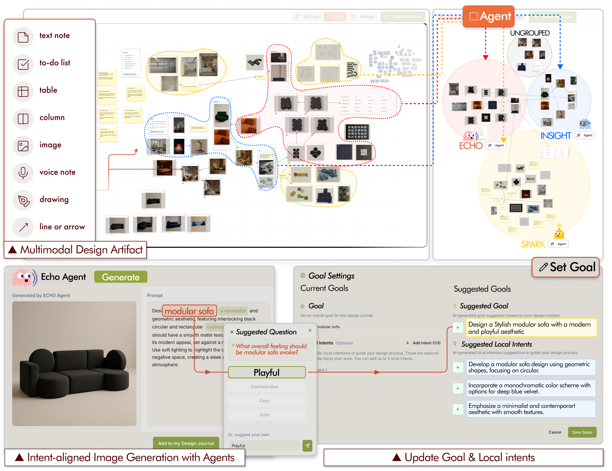

# DesignJournal

**How Agent-Driven Creative Trace Mining Reshapes Design Behavior in a Deployment Study of Intent-Aligned Multimodal Design**

DesignJournal is an agent-driven creative workspace that helps designers collect, organize, and revisit multimodal creative traces. It brings together text notes, images, drawings, voice notes, tables, to-do lists, and relationships between artifacts in one workspace, then uses agents to support intent-aligned image generation and refinement.

> This repository is being prepared for the public release of the DesignJournal research materials. Data and system resources will be added incrementally.

## System Overview

DesignJournal supports four main activities:

1. Capturing multimodal design artifacts in a unified workspace.
2. Organizing artifacts through the **ECHO**, **INSIGHT**, and **SPARK** agents.
3. Generating and refining images based on designers' records and intentions.
4. Updating project goals and local intents throughout the design process.

## About the Research

We studied DesignJournal through a 10-day deployment with eight professional designers. The study examined how agent support reshapes sequential design actions, creative exploration and convergence, and designers' sense of authorship and agency.

## Resources

The following materials will be released in this repository:

- **Participant action data:** anonymized sequential action data for each participant.
- **To-do list data:** data associated with the to-do list interactions used in the study.
- **DesignJournal system:** source code and instructions for running the system.
- **Project page:** an overview of the paper, system, study, and key results.

## Release Status

| Resource | Status |
| --- | --- |
| Participant action data | Available |
| DesignJournal system | Coming soon |
| Project page | Coming soon |

## Citation

Citation information will be added after publication.

## Contact

For questions about this project, please open an issue in this repository.
